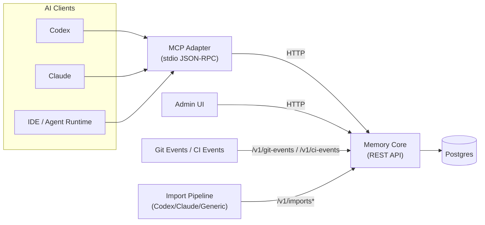
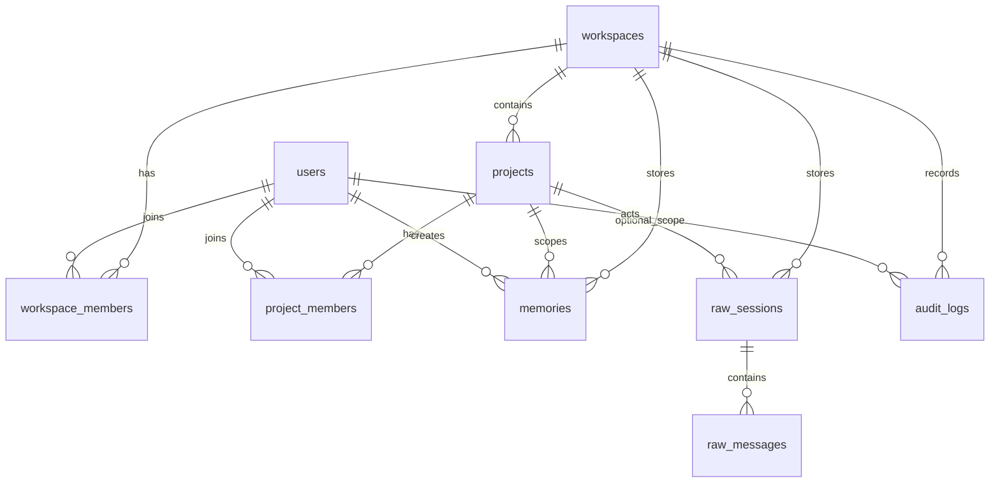

# Claustrum Architecture

## High-Level Topology

## Data Model (Simplified ERD)

## Project Resolution

Resolver order:

1. `github_remote`
2. `repo_root_slug`
3. `manual`

Monorepo subproject format:

- `github:owner/repo`
- `github:owner/repo#apps/memory-core`

Subproject detection is path-based and policy-controlled via `workspace_settings`.

## Auto Switch and Pin Mode

- `ensureContext()` runs before `remember`, `recall`, `search_raw`.
- Repo switch can auto-transition by policy (`auto_switch_repo`).
- Subproject switch can be independently toggled (`auto_switch_subproject`).
- Manual pin mode (`set_project`) disables auto switching until `unset_project_pin()`.

## Raw Import and Raw Search Guardrails

- Raw import pipeline: upload -> parse -> extract -> commit.
- Default recall path remains `memories` only.
- Raw search returns snippet-only responses with max length limits.
- Raw access actions are recorded in `audit_logs`.
