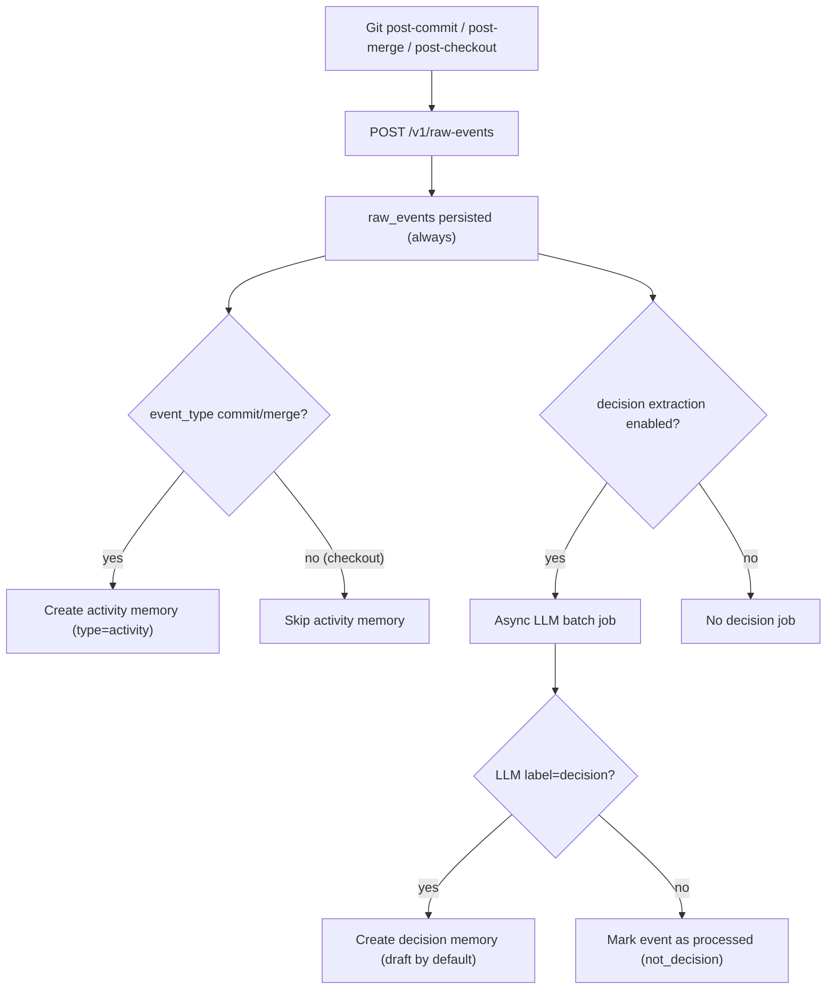

# Flujo de extracción de decisiones

Claustrum siempre guarda los eventos raw de Git.  
Después ejecuta un pipeline de dos etapas:

1. Raw Event -> Activity Memory
2. Raw Event -> Decision Memory (clasificación LLM)

## Flujo



## Regla clave

`decision_keyword_policies` afecta **solo la prioridad de procesamiento LLM**.

- no crea memories por sí solo
- no confirma decisions por sí solo
- solo cambia el orden cuando `decision_extraction_mode=hybrid_priority`

## Política de estado

Default:
- `decision_default_status = draft`
- `decision_auto_confirm_enabled = false`

Auto-confirm opcional:
- `decision_auto_confirm_enabled = true`
- `confidence >= decision_auto_confirm_min_confidence`

## Contrato de salida LLM

Se espera JSON estricto:

```json
{
  "label": "decision | not_decision",
  "confidence": 0.0,
  "summary": "1-2 lines",
  "reason": ["bullet 1", "bullet 2"],
  "tags": ["optional-tag"]
}
```

## Notas operativas

- sin provider key/config, se salta con seguridad y se reintenta luego
- activity logging es estable y barato
- coste controlado por:
  - `decision_batch_size`
  - `decision_backfill_days`
  - `decision_extraction_mode`
