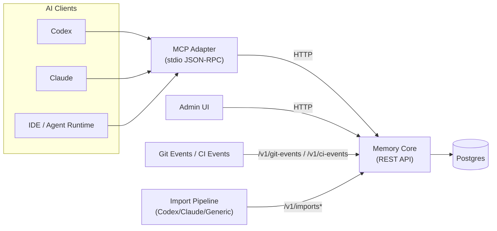
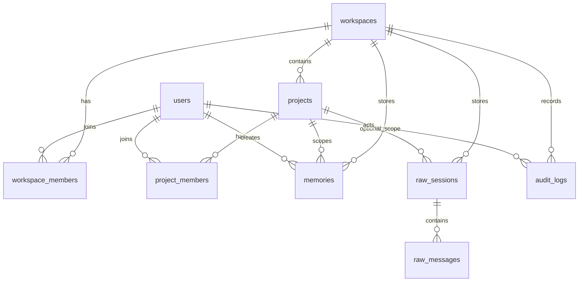

# 클라우스트럼 아키텍처

## 상위 수준 토폴로지

## 데이터 모델(간소화된 ERD)

## 프로젝트 해결

리졸버 순서:

1. `github_remote`
2. `repo_root_slug`
3. `manual`

Monorepo 하위 프로젝트 형식:

- `github:owner/repo`
- `github:owner/repo#apps/memory-core`

하위 프로젝트 감지는 `workspace_settings`을 통해 경로 기반 및 정책으로 제어됩니다.

## 자동 전환 및 핀 모드

- `ensureContext()`은 `remember`, `recall`, `search_raw`보다 먼저 실행됩니다.
- Repo 스위치는 정책(`auto_switch_repo`)에 따라 자동 전환이 가능합니다.
- 하위 프로젝트 스위치를 독립적으로 전환할 수 있습니다(`auto_switch_subproject`).
- 수동 핀 모드(`set_project`)는 `unset_project_pin()`까지 자동 전환을 비활성화합니다.

## 원시 가져오기 및 원시 검색 가드레일

- 원시 가져오기 파이프라인: 업로드 -> 구문 분석 -> 추출 -> 커밋.
- 기본 검색 경로는 `memories`로만 유지됩니다.
- 원시 검색은 최대 길이 제한이 있는 스니펫 전용 응답을 반환합니다.
- 원시 액세스 작업은 `audit_logs`에 기록됩니다.