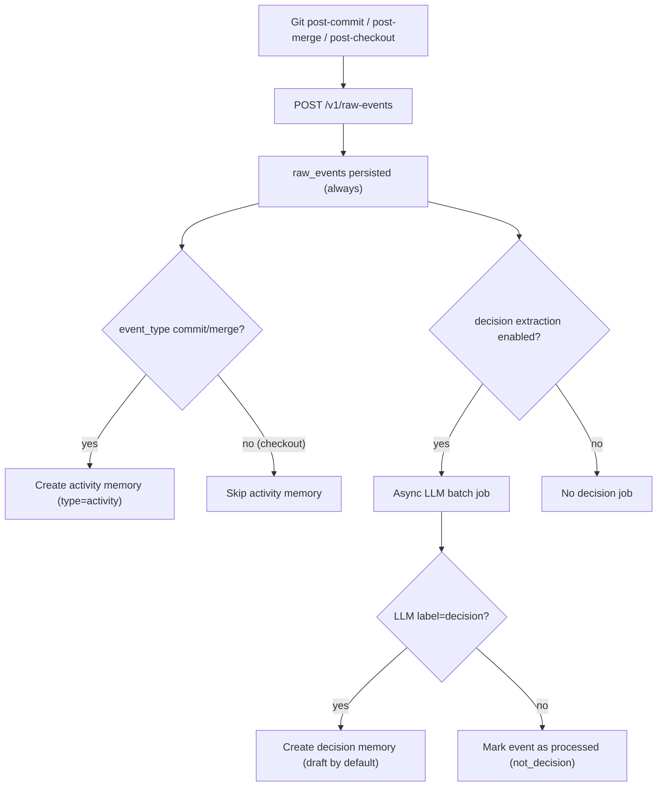

# 의사결정 추출 파이프라인

Claustrum은 항상 모든 Git 원시 이벤트를 저장합니다.

그런 다음 2단계 메모리 파이프라인을 실행합니다.

1. 원시 이벤트 -> 활동 메모리(예측 가능)
2. 원시 이벤트 -> 결정 메모리(LLM 분류)

## 흐름


## 중요 규칙: 키워드는 예약 전용입니다.

`decision_keyword_policies`은 **LLM 처리 우선순위에만** 영향을 미칩니다.

- 추억은 저절로 만들어지지 않습니다.
- 그 자체로 결정을 확정하지는 않습니다.
- `decision_extraction_mode=hybrid_priority`일 경우에만 대기열 순서가 변경됩니다.

## 결정 상태 정책

기본값:

- `decision_default_status = draft`
- `decision_auto_confirm_enabled = false`

선택적 자동 확인:

- `decision_auto_confirm_enabled = true`인 경우에만 활성화됩니다.
- `confidence >= decision_auto_confirm_min_confidence` 필요

## LLM 출력 계약

분류자는 엄격한 JSON을 기대합니다.

```json
{
  "label": "decision | not_decision",
  "confidence": 0.0,
  "summary": "1-2 lines",
  "reason": ["bullet 1", "bullet 2"],
  "tags": ["optional-tag"]
}
```
## 운영 참고 사항

- LLM 제공자 키/구성을 사용할 수 없는 경우 결정 추출을 안전하게 건너뛰고 나중에 다시 시도합니다.
- 활동 로깅은 예측 가능하고 비용이 저렴합니다.
- 의사결정 추출 비용은 다음에 의해 제어됩니다.
  - `decision_batch_size`
  - `decision_backfill_days`
  - `decision_extraction_mode`(`llm_only` 대 `hybrid_priority`)