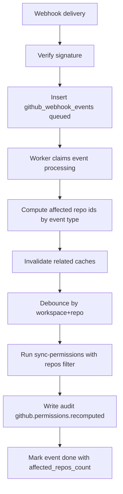

# GitHub 부분 재계산

## 목표

GitHub가 웹후크 이벤트를 보내면 Claustrum은 전체 작업공간 전체 재계산을 실행하는 대신 영향을 받은 저장소에 대해서만 권한을 재계산합니다.

## 지원되는 이벤트

- `installation_repositories`
- `team`
- `membership`
- `repository`
- `team_add`
- `team_remove`

## 이벤트 -> 영향을 받는 범위

- `installation_repositories`
  - `repositories_added` + `repositories_removed`로 읽습니다.
  - 해당 저장소 이름에 대해서만 저장소 동기화를 실행합니다.
  - 연결된 영향을 받는 저장소에 대해서만 권한을 다시 계산합니다.

- `team` / `membership`
  - `team.id` 추출
  - `github_repo_teams_cache`에서 영향을 받은 저장소를 찾습니다.
  - 해당 저장소만 다시 계산합니다.

- `repository` (`action=renamed`)
  - 업데이트 `github_repo_links.full_name`
  - 기본적으로 권한을 다시 계산하지 않습니다.

- `team_add` / `team_remove`
  - 저장소 + 팀 추출
  - 저장소/팀 캐시를 무효화합니다.
  - 영향을 받은 저장소만 다시 계산합니다.

## 캐시 무효화

- 팀 관련 이벤트:
  - 팀의 `github_team_members_cache` 삭제

- repo-team 관련 이벤트:
  - 영향을 받은 저장소 ID에 대해 `github_repo_teams_cache` 삭제

- 부분 재계산 전:
  - 영향을 받은 저장소 ID에 대해 `github_permission_cache` 삭제

## 디바운스

버스트 재계산을 방지하기 위해 동일한 `workspace_id + repo_id`에 대한 반복 재계산은 짧은 기간(8초)으로 디바운싱됩니다.

## 작업자 흐름

## 작업 참고 사항

- `delivery_id` 고유 제약 조건으로 전송 중복 제거가 보장됩니다.
- 실패한 이벤트는 최대 3번까지 재시도됩니다.
- 서명 실패 시 `401`이 반환되고 `github.webhook.signature_failed`으로 감사됩니다.
- 웹훅 모드(`add_only` / `add_and_remove`)는 웹훅 기반 역할 업데이트가 적용되는 방식을 제어합니다.