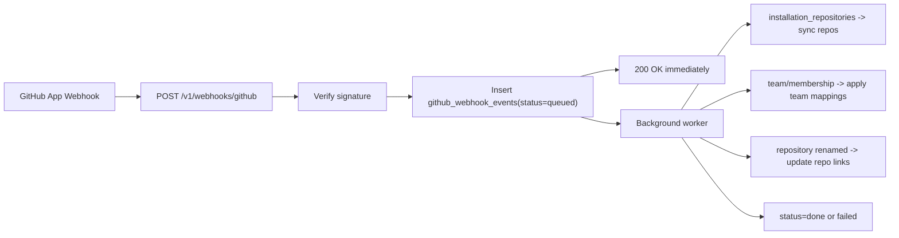

# GitHub 웹훅

## 범위

웹훅 자동화는 GitHub 이벤트를 처리하고 필요한 동기화 작업(저장소 동기화, 팀 매핑, 부분 권한 재계산)만 적용합니다.

구현됨:

- `POST /v1/webhooks/github` 서명 확인 포함(`X-Hub-Signature-256`)
- `github_webhook_events`의 대기열 우선 수집
- 진행 중인 비동기 작업자(`queued -> processing -> done|failed`)
- `installation_repositories`의 자동 저장소 동기화
- `team` / `membership`의 선택적 팀 매핑 애플리케이션
- `repository`의 저장소 이름 변경 캐시 업데이트
- 영향을 받은 저장소에 대해서만 부분 권한 재계산([세부](github-partial-recompute))

## 보안

- 비밀 소스: `GITHUB_APP_WEBHOOK_SECRET`(env 전용)
- 유효하지 않거나 누락된 서명: 대기열에 넣기 전에 거부됨
- 배달 ID 중복 제거: DB에 고유한 `delivery_id`
- 작업자는 최대 3번의 재시도가 포함된 재시도 안전 상태 전환을 사용합니다.

## 이벤트 흐름

## 작업 공간 제어

작업공간 설정:

- `github_webhook_enabled`(기본값 `false`)
- `github_webhook_sync_mode` (`add_only` | `add_and_remove`, 기본값 `add_only`)
- `github_team_mapping_enabled`(기본값 `true`)

작업 영역에 대해 웹후크가 비활성화된 경우 대기 중인 전달은 승인되지만 동기화 논리에 의해 무시됩니다.

## 관리 UI

위치: **작업 공간 -> 통합 -> GitHub**

- 웹훅 동기화 토글/모드
- 팀 매핑 활성화 토글
- 웹훅 엔드포인트 힌트(`/v1/webhooks/github`)
- 최근 배송 테이블(`queued/processing/done/failed`)

## 문제 해결

- `Invalid GitHub webhook signature`:
  - 앱 웹훅 비밀이 `GITHUB_APP_WEBHOOK_SECRET`과 일치하는지 확인하세요.
- 배송 유지 `failed`:
  - `GITHUB_APP_ID` / `GITHUB_APP_PRIVATE_KEY` 확인
  - 설치가 작업 공간에 연결되어 있는지 확인하십시오.
- 팀 기반 역할 변경 없음:
  - `github_team_mapping_enabled=true` 확인
  - 매핑이 존재하고 연결된 사용자가 구성되었는지 확인합니다(`github_user_links`).