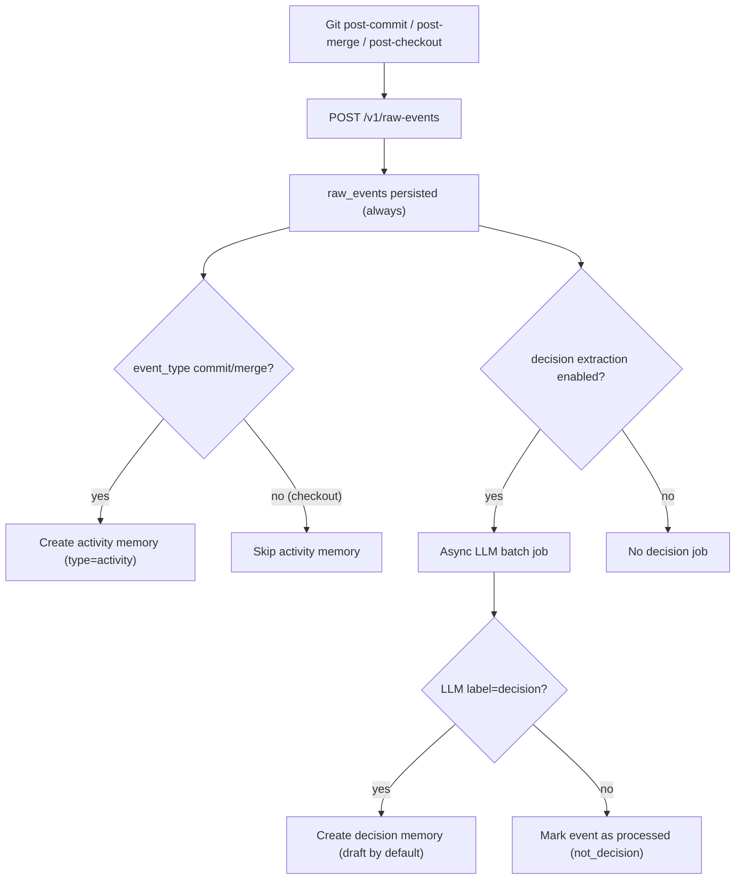

# Decision 提取流水线

Claustrum 会始终保存 Git raw events。  
之后执行两段式 memory 流程：

1. Raw Event -> Activity Memory
2. Raw Event -> Decision Memory（LLM 分类）

## 流程



## 关键规则

`decision_keyword_policies` **只用于 LLM 调度优先级**。

- 不会直接创建 memory
- 不会直接确认 decision
- 只在 `decision_extraction_mode=hybrid_priority` 时影响队列顺序

## Decision 状态策略

默认：
- `decision_default_status = draft`
- `decision_auto_confirm_enabled = false`

可选自动确认：
- `decision_auto_confirm_enabled = true`
- `confidence >= decision_auto_confirm_min_confidence`

## LLM 输出契约

分类器要求严格 JSON：

```json
{
  "label": "decision | not_decision",
  "confidence": 0.0,
  "summary": "1-2 lines",
  "reason": ["bullet 1", "bullet 2"],
  "tags": ["optional-tag"]
}
```

## 运维说明

- 若无可用 LLM key/config，则安全跳过并后续重试
- activity logging 成本低、可预测
- 抽取成本主要受以下参数影响：
  - `decision_batch_size`
  - `decision_backfill_days`
  - `decision_extraction_mode`
